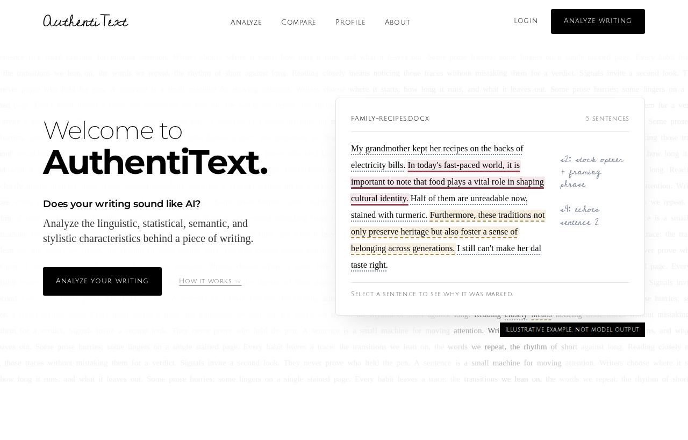
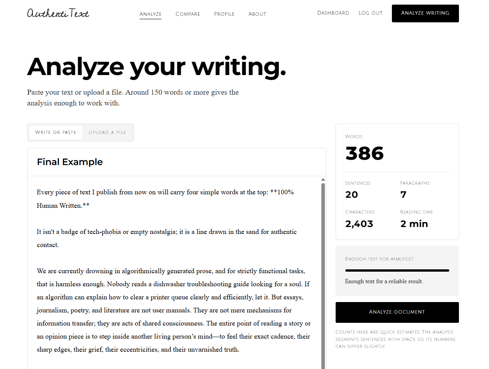
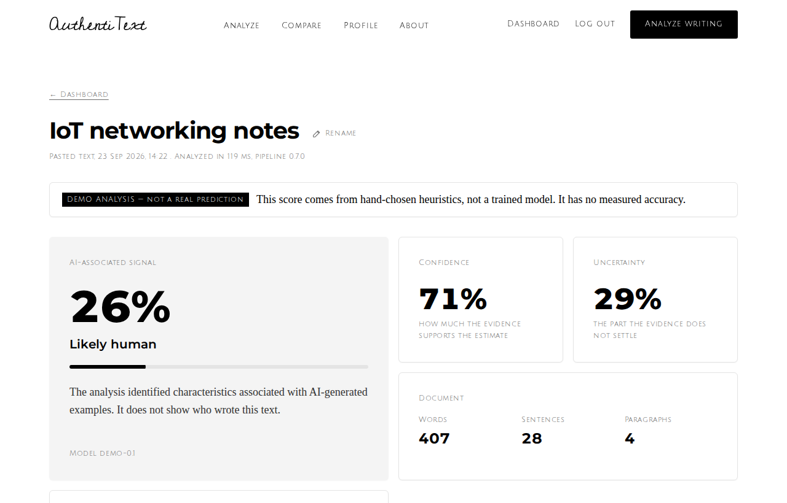
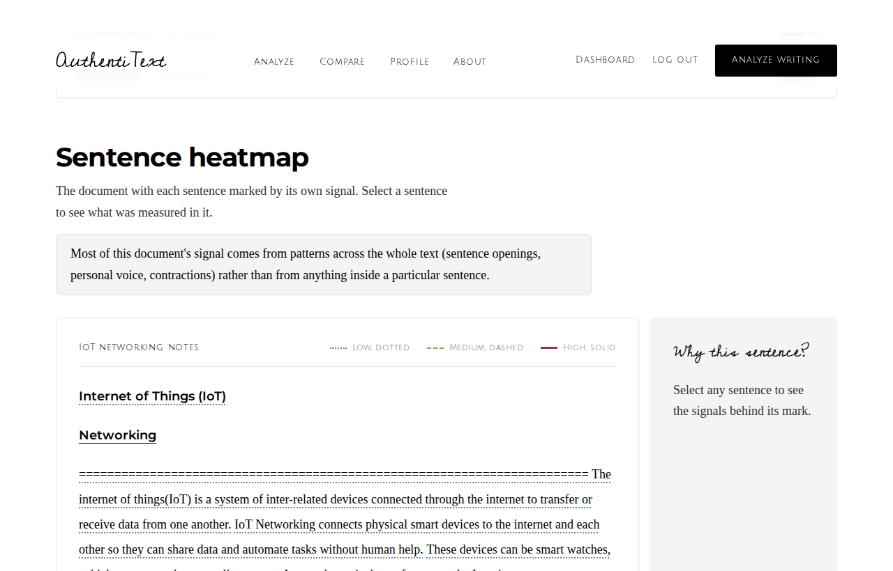
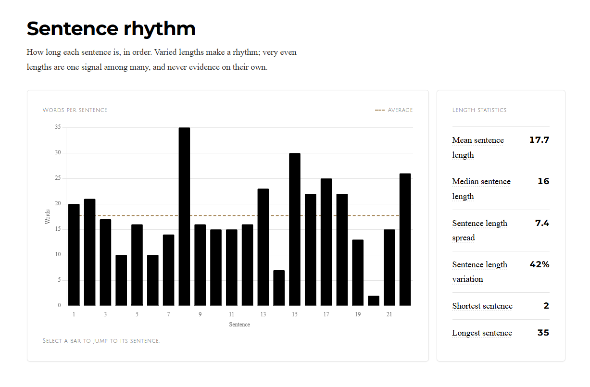
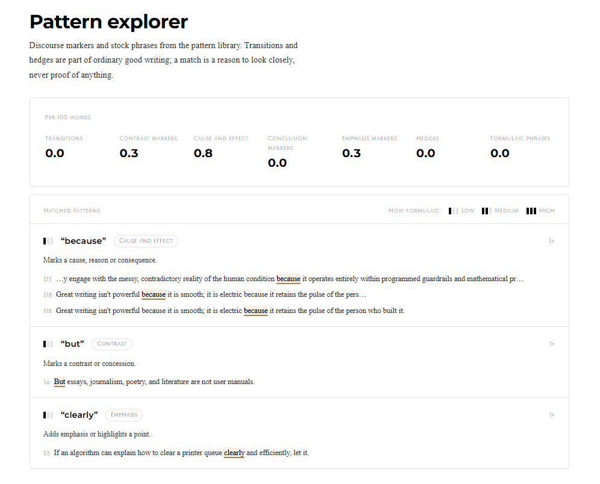
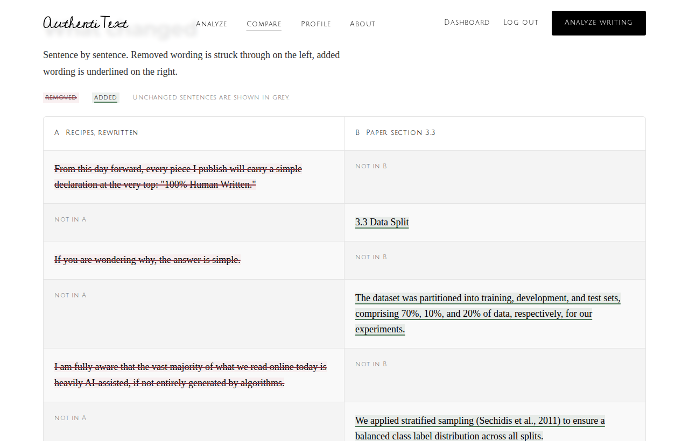
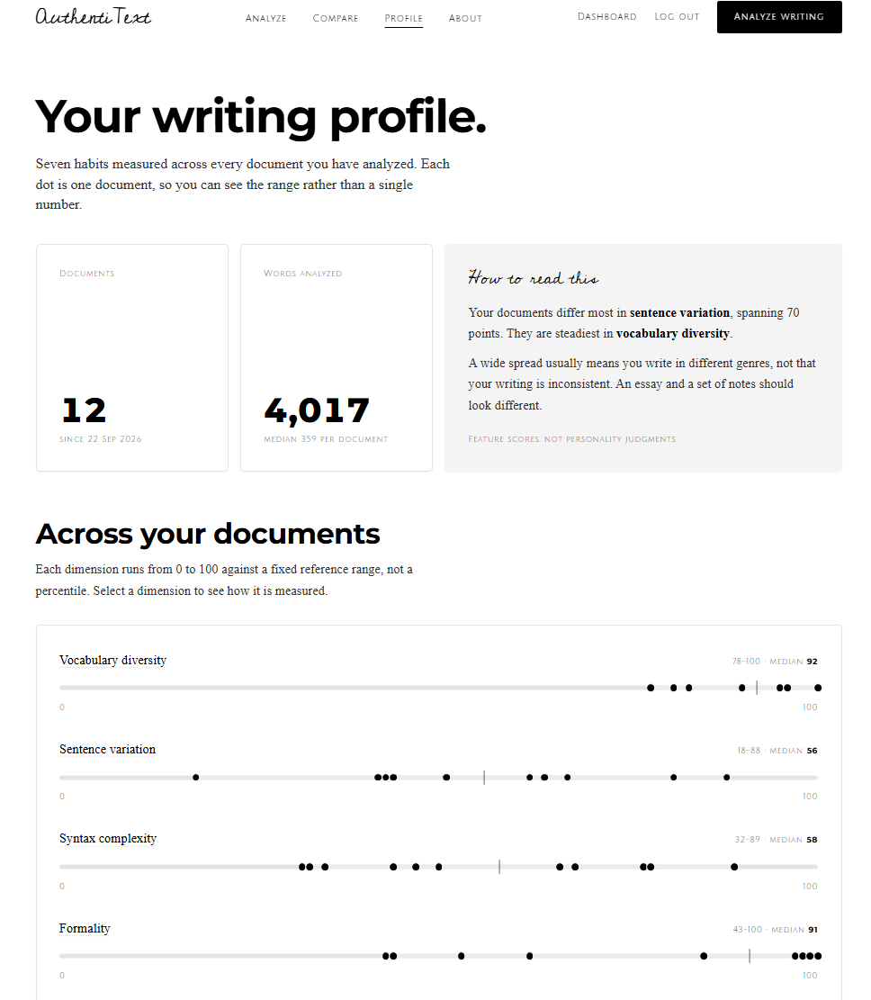
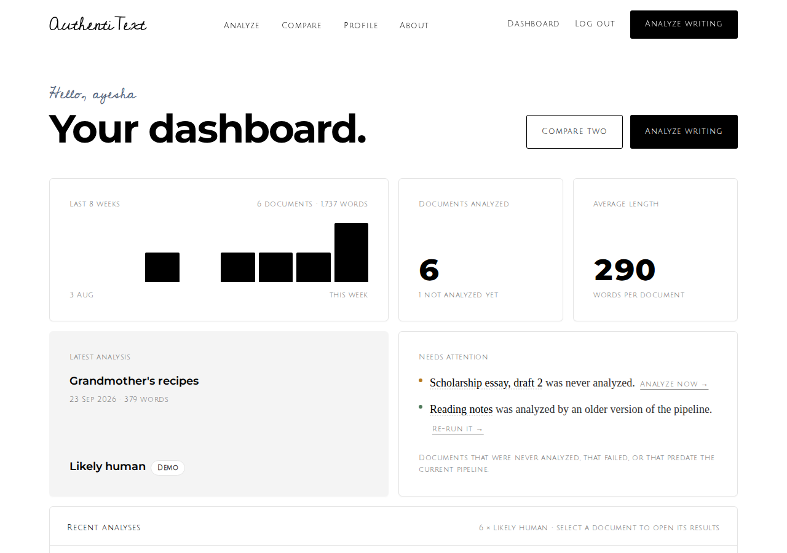

# AuthentiText

**Analyze the signals behind your writing.**

AuthentiText is an NLP-powered writing analysis platform that combines linguistic analysis, stylometry, statistical text features, semantic similarity and machine learning to provide explainable document-level and sentence-level writing analysis.

The AI-detection result is one output of the pipeline, not the point of it. The project is about taking raw text through preprocessing, feature extraction, statistics, classification, explanation and visualisation, and being honest at every step about what the numbers do and do not mean.



---

## What it does

- **Reads documents** you paste, or upload as TXT, PDF or DOCX, validated by their actual contents rather than their filename.
- **Runs a 77-feature NLP pipeline**: spaCy preprocessing, document statistics, lexical, syntactic, discourse, statistical, semantic and stylometric features, plus a configurable pattern library.
- **Explains every number.** Each feature carries a plain-English description, and each says why it could not be measured when it can't be.
- **Reports a result honestly**: probability, confidence and uncertainty as three separate numbers, "Insufficient evidence" below 150 words, and a demo detector that states it has no measured accuracy.
- **Marks every sentence** in an interactive heatmap, with the reasons behind each mark.
- **Compares two documents** sentence by sentence, with every metric side by side.
- **Exports** a full PDF report, a marked-up PDF or Word heatmap, JSON and CSV.

## Screenshots

| | |
|---|---|
| **The editor**, with live counts and an evidence gauge | **Results**, with probability, confidence and uncertainty kept separate |
|  |  |
| **Sentence heatmap**, each mark with its reasons | **Sentence rhythm**, click a bar to jump to its sentence |
|  |  |
| **Pattern explorer**, stock phrases shown in context | **Comparison**, a draft against its revision |
|  |  |
| **Writing profile**, one dot per document | **Dashboard** |
|  |  |

## The pipeline

```
document (TXT / PDF / DOCX / pasted)
  → text extraction        validated by file signature, not extension
  → paragraph segmentation exact offsets; soft wraps and headings handled
  → spaCy                  tokens, lemmas, POS, dependencies, sentences
  → document statistics    lengths, distribution, punctuation
  → lexical features       MATTR, MTLD, rare words, repeated phrases
  → syntactic features     POS mix, parse depth, clauses, passive voice
  → discourse              markers and a configurable pattern library
  → statistical features   entropy, burstiness, n-grams, distinctive terms
  → semantic features      sentence embeddings: coherence, redundancy, diversity
  → stylometry             F-score and the 0-100 writing profile
  → detector               probability, confidence, uncertainty, per-signal explanation
  → results, heatmap, reports
```

A 450-word document takes about 40 ms after warm-up. See [docs/NLP_PIPELINE.md](docs/NLP_PIPELINE.md).

## Honesty, by design

This is a detection tool, so the interesting engineering is in refusing to overclaim.

- **The shipped detector is a demo** built from hand-chosen signals. It is labelled `DEMO ANALYSIS — not a real prediction` on every result and states that it has no measured accuracy. `python manage.py train_detector` trains a real classifier on labelled data and reports the metrics it measured.
- **Probability is not confidence.** Confidence falls when the text is short, when signals could not be measured, and when signal families disagree.
- **No number where there is no evidence.** Under 150 words the result is "Insufficient evidence" with reasons. Any measure that cannot be computed says why.
- **Perplexity is absent**, because the project ships no language model, and a fabricated substitute would be worse than a gap.
- **What testing found is written down**, including that AI *rewrites* of human text score lower than the originals. See [docs/EVALUATION.md](docs/EVALUATION.md).

## Technology

**Backend** Django 5, Python 3.11+ · **NLP** spaCy, wordfreq, scikit-learn, optional sentence-transformers · **Documents** PyMuPDF, python-docx, ReportLab · **Frontend** Django templates, Tailwind CSS, vanilla JavaScript, Chart.js — no frontend framework, so the browser-to-Django boundary stays visible.

## Getting started

```bash
python -m venv .venv && source .venv/bin/activate     # Windows: .venv\Scripts\Activate.ps1
pip install -r requirements.txt
cp .env.example .env
npm install && npm run build:css
python manage.py migrate
python manage.py runserver
```

Full instructions, including Windows and the optional embedding model, are in [docs/SETUP.md](docs/SETUP.md).

## Tests

```bash
python manage.py test     # 295 tests: pipeline, models, views, permissions, reports
npm run test:js           # 20 tests: the editor's counting rules
```

The editor counts words in the browser and on the server; both run against the same fixture file, so the live counts can never drift from what is saved. Tests also cover the things that bit during development: Tailwind purging classes built at runtime, headings distorting rhythm measures, PDF text arriving hard-wrapped, and a heatmap that contradicted its own headline.

## Documentation

| | |
|---|---|
| [ARCHITECTURE.md](docs/ARCHITECTURE.md) | how the project is put together and why |
| [NLP_PIPELINE.md](docs/NLP_PIPELINE.md) | each stage, and the decisions behind it |
| [FEATURES.md](docs/FEATURES.md) | every feature, generated from the code |
| [DETECTION.md](docs/DETECTION.md) | how a result is produced and what it means |
| [EVALUATION.md](docs/EVALUATION.md) | what testing on real pairs actually showed |
| [LIMITATIONS.md](docs/LIMITATIONS.md) | what this cannot do |
| [SETUP.md](docs/SETUP.md) | installation and settings |
| [API.md](docs/API.md) | routes, JSON endpoints and the rules that apply |

## What a result means

The analysis identifies characteristics associated with AI-generated examples. It does not prove authorship, AI use, plagiarism, academic misconduct or intent. Every pattern it measures also appears in human writing. Treat a result as a reason to read more closely, never as a verdict.

## Roadmap

Bengali and multilingual analysis, a trained classifier on collected pairs, batch analysis, and a browser extension. Nothing is claimed as supported until it is.
